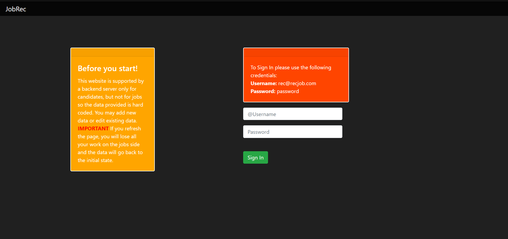
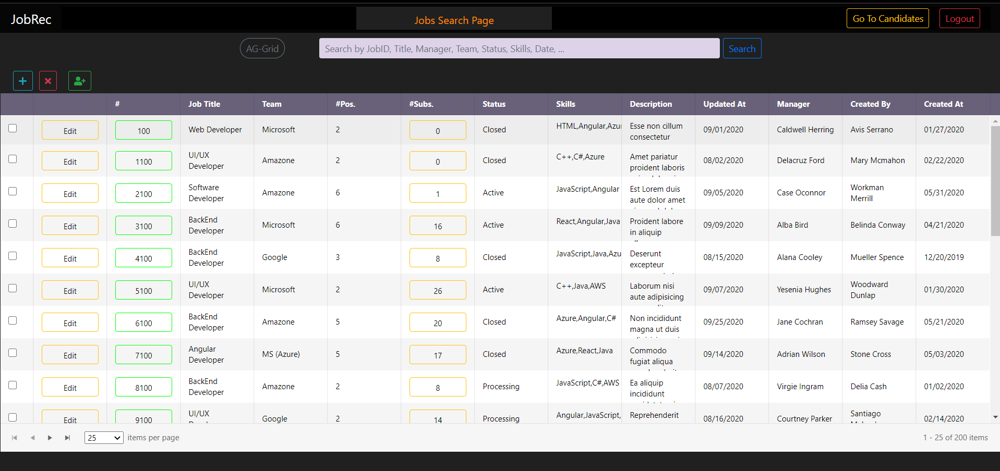
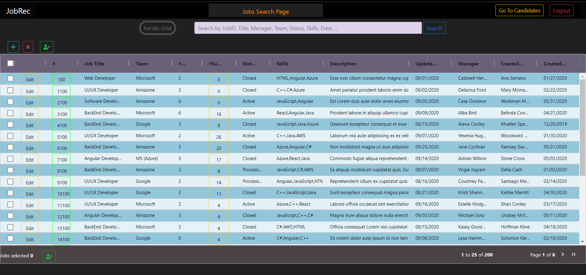
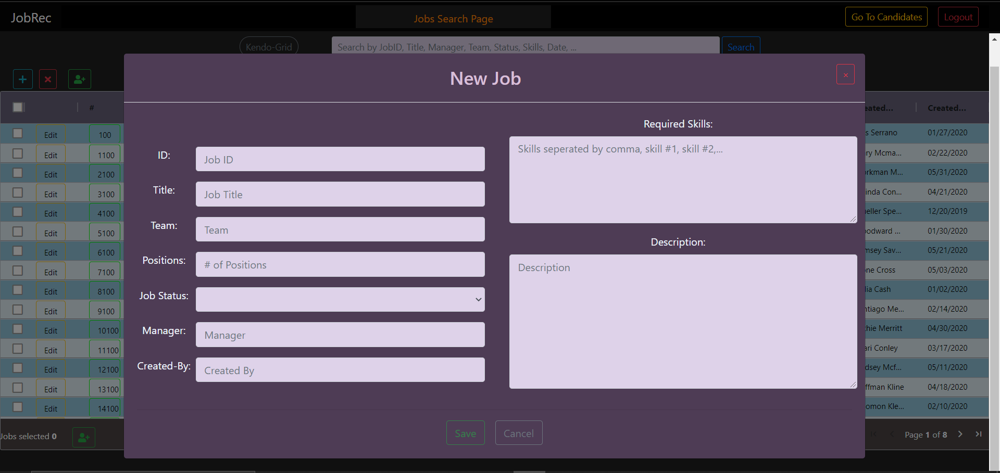
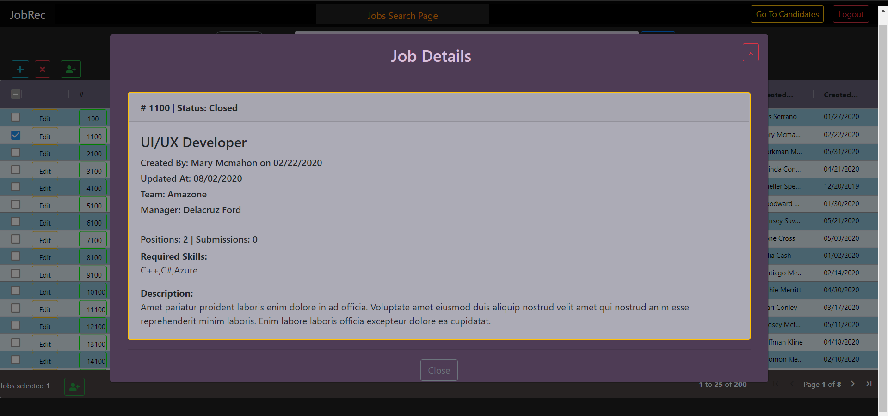
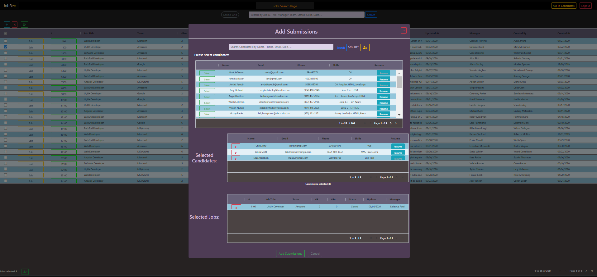

# JobRecruiters

## Overview

This website is a tool to help recruiters manage job openings and candidates by allowing recruiters to add, view, and edit job openings and candidates profiles. 
The site has a smart tool that matches candidates with job openings based on their skills and job requirements.

## Getting Started
These instructions will get you a copy of the project up and running on your local machine for development and testing purposes.

### Installing
Git clone the repository to your local machine:

HTTPS:
```
https://github.com/AmjedAyoub/JobRecruiters.git
```
SSH:
```
git@github.com:AmjedAyoub/JobRecruiters.git
```
Open the cloned repository in your visual studio.

You will then be able to start the app locally by running the server:
* In the terminal navigate to JobRec/backend
* Run the command
```
npm install
node ./server
```
* In a new terminal navigate JobRec 
* Run the command
```
npm install
ng serve
```
* Open your browser on http://localhost:4200/

## Screenshots

### Sign-In page


### Job-Search with Kendo-Grid page


### Job-Search with AG-Grid page


### New Job page


### Job Details page


### Add Submissions page


## Technologies & Tools
* Angular
* NodeJS
* MongoDB

## Links
This program is deployed on [AWS](http://jobrec-env.eba-f2ufeakw.us-east-2.elasticbeanstalk.com).\
This program is published on [GitHub](https://github.com/AmjedAyoub/JobRecruiters).

## Authors
See contribution history [here](https://github.com/AmjedAyoub/JobRecruiters/graphs/contributors).